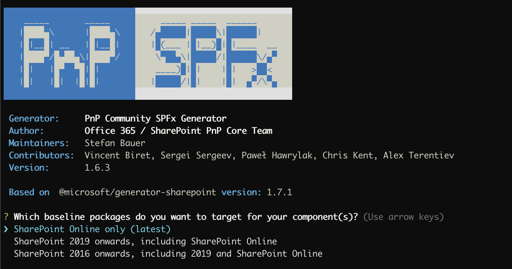

# Feature overview

The official SPFx generator targets for three specific platforms:

* SharePoint Online
* SharePoint Online and SharePoint 2019
* SharePoint Online, SharePoint 2019, SharePoint 2016

Not all those options generate the same version of SPFx projects and the available features are limited to the lowest supported version.

Depending on the selections made different options can be supported by the SharePoint Framework.

## Angular Elements

Angular Elements is currently supported using Angular 6, Angular 7, Angular 8.

## SharePoint Online

This options create a project based on the latest SPFx version 1.7.1

### Addons

| | jQuery | pnp/pnpjs | PnP Property Controls | PnP Reusable Controls |
|:-----|:-----:|:-----:|:-----:|:-----:|
| ReactJS|✅|✅|✅|✅|
| KnockoutJS|✅|✅|✅| 
| No Framework|✅|✅|✅| 
| VueJS|✅|✅|✅| 
| HandlebarsJS|✅|✅|✅| 
| Angular Elements|✅|✅|✅|
| Aurelia|✅|✅|✅|

### Vetting Options

| | WebPack Bundle Analyzer | StyleLint 
|:-----|:-----:|:-----:|
|ReactJS|✅|✅|
|KnockoutJS|✅|✅|
|No Framework|✅|✅|
|VueJS|✅| |
|HandlebarsJS|✅|✅|
|Angular Elements|✅|✅|
|Aurelia|✅|✅|

### Test Framework

| |**Jest**|
|:-----|:-----:|
| ReactJS |✅|
| KnockoutJS| | 
| No Framework|✅|
| VueJS| |
| HandlebarsJS| |
| Angular Elements| |

## SharePoint Online and SharePoint 2019

This option creates a project based on SPFx version 1.4.0

In version 1.11.1 - Support for VueJS was removed due limitations of the SPFx project setup

### Addons

| | jQuery | pnp/pnpjs | PnP Property Controls | PnP Reusable Controls |
|:-----|:-----:|:-----:|:-----:|:-----:|
| ReactJS|✅|✅|✅|✅|
| KnockoutJS|✅|✅|✅| 
| No Framework|✅|✅|✅|  
| HandlebarsJS|✅|✅|✅| 
| Angular Elements|✅|✅|✅|
| Aurelia|✅|✅|✅|

### Vetting Options

| | WebPack Bundle Analyzer | StyleLint 
|:-----|:-----:|:-----:|
|ReactJS|✅|✅|
|KnockoutJS|✅|✅|
|No Framework|✅|✅|
|HandlebarsJS|✅|✅|
|Angular Elements|✅|✅|
|Aurelia|✅|✅|

### Test Framework

| |**Jest**|
|:-----|:-----:|
| ReactJS |✅|
| KnockoutJS| | 
| No Framework|✅|
| HandlebarsJS| |
| Angular Elements| |

## SharePoint Online, SharePoint 2019, SharePoint 2016

This option creates a project based on SPFx version 1.1.0. This old version makes avoid to securly use the following frameworks:

* VueJS
* HandlebarsJS
* Angular Elements

### Addons

| | jQuery | pnp/pnpjs | PnP Property Controls | PnP Reusable Controls |
|:-----|:-----:|:-----:|:-----:|:-----:|
| ReactJS|✅|✅| | |
| KnockoutJS|✅|✅| | 
| No Framework|✅|✅| | 

### Vetting Options

| | WebPack Bundle Analyzer | StyleLint 
|:-----|:-----:|:-----:|
|ReactJS|✅|✅|
|KnockoutJS|✅|✅|
|No Framework|✅|✅|

### Test Framework

| |**Jest**|
|:-----|:-----:|
| ReactJS |✅|
| KnockoutJS| | 
| No Framework|✅|
