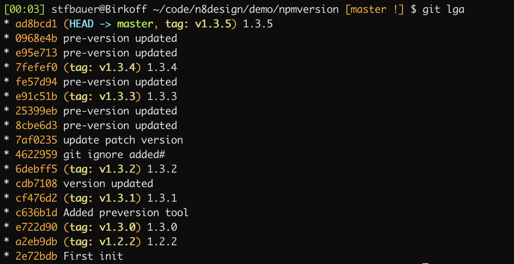

# Standard gulp tasks

* build - Builds the client-side solution project.
* bundle - Bundles the client-side solution project entry point and all its dependencies into a single JavaScript file.
* serve - Serves the client-side solution project and assets from the local machine.
* clean - Cleans the client-side solution project's build artifacts from the previous build and from the build target directories (lib and dist).
* test - Runs unit tests, if available, for the client-side solution project.
* package-solution - Packages the client-side solution into a SharePoint package.
* deploy-azure-storage - Deploys client-side solution project assets to Azure Storage.

## Additional gulp tasks

* dist - Combines clean, bundle and package-solution (above) to package the solution for production
* dev - Combines clean, bundle and package-solution (above) to package the solution for development

## npm version

'[npm version](https://docs.npmjs.com/cli/version.html)' is a command that increases the version number in the package.json file. 

With this generator out of the box, using `npm version` will change the version in the following files:

* `package.json`
* `config/package-solution.json`
* `teams/manifest.json` (if applicable)

To use `npm version`, you must have committed your changes - your working directory must be clean. If it isn't, you'll see an error like:

```
npm ERR! Git working directory not clean.
npm ERR! M config/package-solution.json
...
```

Once you have committed all of your changes, you can run one of the following:

* `npm version major` Set a major version and upgrade the ‘package.json’ to v1.0.0, v2.0.0, …
* `npm version minor` Set a minor version and upgrade the ‘package.json’ to v1.1.0, v1.2.0, v1.3.0, …
* `npm version patch` Set a minor version and upgrade the ‘package.json’ to v1.1.1, v1.1.2, v1.1.3, …

**Note**

It is up to you to ensure that the versions all match before you run these commands. Otherwise, your version numbers may be inconsistent.

If you'd like to customize what happens when you run `npm version`, you can add your customizations to the `pre-version.js` file in the `tools` directory.

The current commit will also be [tagged](https://git-scm.com/book/en/v2/Git-Basics-Tagging) on the git repository.



**Info**

Additional information:

* [npm-version](https://docs.npmjs.com/cli/version.html) - npm documentation
* [git-tag](https://git-scm.com/book/en/v2/Git-Basics-Tagging) - git documentation
* [Use `npm version` to upgrade the version of your SPFx solution](https://n8d.at/blog/use-npm-version-to-upgrade-version-of-your-spfx-solution/)
